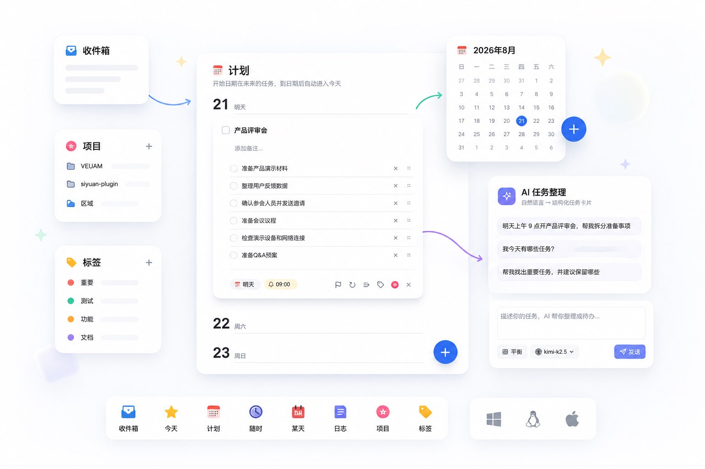
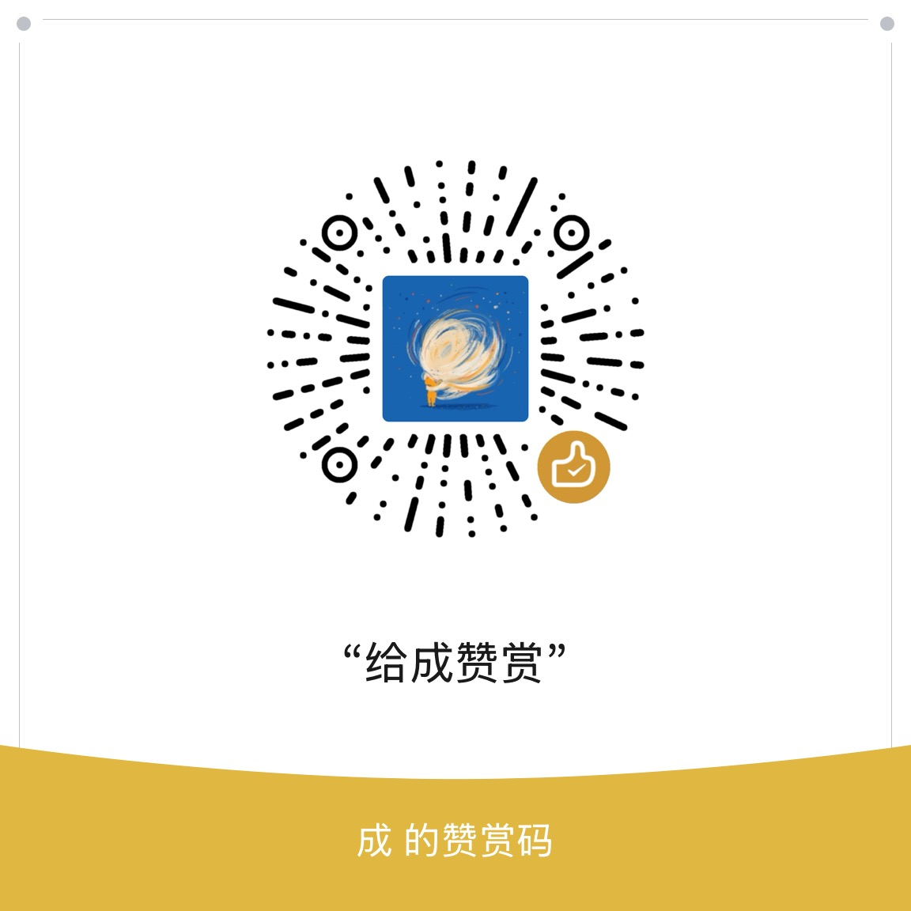

SiYuan Things 是一款灵感来自 Things 的思源笔记 GTD 任务管理插件。它把任务、项目、区域、标签、日期与检查项组织在一个清晰的工作流中，并提供对话式 AI 助手，帮助你创建、查询和整理任务。

## 功能概览

| 能力 | 说明 |
| --- | --- |
| **GTD 任务流** | 使用收件箱、今天、计划、随时、某天和日志管理任务生命周期。 |
| **项目与分类** | 通过项目、区域、可排序与折叠的标题分组和标签组织工作；区域可使用项目胶囊筛选全部、进行中与已完成任务。 |
| **日期与提醒** | 支持开始日期、具体时间、截止日期、提醒及“某天”任务。 |
| **重复任务** | 支持每天、工作日、每周、每月和每年重复，完成后自动生成下一次任务。 |
| **任务详情** | 支持备注（Markdown 渲染与图片预览）和检查项，并可将单条任务的完整数据一键复制为 Markdown。 |
| **快速查找** | 在任务列表内搜索标题、备注、检查项、归属、标签、状态和日期，支持“今天”等视图语义。 |
| **AI 任务助手** | 通过连续对话创建、查询、归纳、修改和删除任务。 |
| **主题与布局** | 跟随思源明暗主题，侧边栏、任务列表与 AI 面板采用统一的卡片视觉。 |
| **标签页联动** | 可在点击文档或 Things 标签时自动切换并定位对应侧边栏，也可在插件设置中关闭。 |
| **GitHub 直连更新** | 可选绕过思源集市下载通道，直接检查 Things 官方 GitHub 仓库的正式版，校验安装包后交给思源更新。 |
| **安全操作** | 删除等高影响操作会先展示预览并等待确认。 |
| **工作空间数据** | 通过思源插件数据接口保存，可跟随工作空间的同步设置。 |

## AI 任务助手

你可以直接使用自然语言，例如：

> 明天上午 9 点开产品评审会，帮我拆分准备事项。

> 计划中有哪些任务？

> 找出可能重复的任务，并建议保留哪些。

AI 支持连续对话，可以继续修改当前草稿，也可以操作上一轮查询到的任务。每轮生成的任务都会保留在对应对话中；当前轮待添加任务默认展开，历史轮自动收起，已添加任务会显示其项目、区域或收件箱位置。遇到“创建还是查询”这类含糊请求时，可以直接点击快捷按钮继续。AI 功能为可选功能，需要配置兼容 OpenAI 接口的 AI 服务。

你也可以把侧边栏中的收件箱、今天、计划、随时、某天、日志，或具体项目、区域、标签拖到 AI 输入框。无需精确抓住图标，只要最终落入输入框就会添加为本次请求的设定胶囊；在侧边栏列表内拖动则仍用于排序。项目与区域会互相替换，标签可以叠加多个；发送后这些临时设定会自动清空。

## 使用要求

- 思源笔记 `3.7.0` 或更高版本。
- 使用 AI 功能时，需要在思源或插件设置中配置可用的 AI 服务。

## 安装

### 从集市安装

插件上架后，在思源笔记中打开「集市 → 插件」，搜索 `Things` 并安装。

### 手动安装

1. 从 [GitHub Releases](https://github.com/chengslog/siyuan-things/releases) 下载 `package.zip`。
2. 解压到 `<思源工作空间>/data/plugins/siyuan-things/`。
3. 重启思源，或重新加载插件。

## 基本使用

1. 点击思源停靠栏中的 Things 图标，进入任务管理页面。
2. 使用收件箱、今天、计划、随时、某天和日志安排任务。
3. 在区域详情中使用标题下方的项目胶囊筛选整页任务；在项目和标签详情中点击“+”时，新建卡片会出现在当前阅读位置。项目分组可拖动排序和折叠，“已完成”固定在底部。
4. 在任务卡片中设置项目、区域、标签、日期、截止日期、提醒、重复规则、备注与检查项；需要分享时可一键复制为 Markdown。
5. 在 AI 面板中用自然语言创建、查询、修改或删除任务；需要更多任务空间时可将面板最小化为 AI 按钮，再次点击即可恢复当前会话；需要指定归属时，可将侧边栏项目、区域、标签或日期视图拖入输入框。
6. 在思源插件菜单中点击“Things 任务管理”可直接打开设置；可按需关闭“标签页联动侧边栏”，任务管理页面仍从左侧 Things Dock 进入。
7. 若思源集市更新通道暂时不可用，可在设置中启用“从 GitHub 自动更新”，或点击该设置旁的刷新图标手动检查。启动检查发现新版本后会先询问，手动更新则关闭设置并使用独立卡片展示下载、校验、安装和重载进度；成功后点击“重新打开 Things”会关闭旧页签、加载新实例并恢复侧边栏，失败时可重试，不会未经确认自动覆盖插件。

## AI 配置与隐私

插件可以复用思源中已经配置的 AI 服务（模型列表按服务商分组，默认跟随思源 AI 当前选择的模型），也可以在插件设置中填写自定义的 OpenAI 兼容接口地址、API Key 和模型名称。“启用 AI 功能”开关会统一展开或折叠服务来源与自定义配置。

进行任务查询或整理时，完成请求所需的任务上下文会发送给你选择的 AI 服务商。插件本身不提供 AI 账号或中转服务。启用 AI 前，请确认所使用服务商的隐私和数据保留政策。

- 未启用 AI 时，插件不会主动向 AI 服务商发送任务内容。
- 启用 AI 后，用户消息及完成请求所需的任务标题、日期、归属、标签、备注和检查项可能被发送至所选服务商。
- API Key 保存在当前思源工作空间的插件设置数据中，请依靠操作系统和工作空间权限保护该数据。
- 插件不包含作者运营的统计、广告或中转服务。

## 数据与同步

任务和插件设置通过思源插件数据接口保存在当前工作空间。是否同步到其他设备取决于工作空间的同步配置。删除标签时，插件会同时清理任务和可恢复任务中的对应标签引用。

为避免同步冲突，建议一台设备完成同步后，再在另一台设备编辑同一批任务。

## 本地开发

```bash
pnpm install
pnpm test
pnpm run build
```

将 `dist/` 中的内容复制到 `<思源工作空间>/data/plugins/siyuan-things/`，然后重启思源或重新加载插件。

如果该工作空间启用了同步，本地开发时建议在 `<思源工作空间>/data/.siyuan/syncignore` 中加入 `plugins/siyuan-things/**/*`，避免反复覆盖构建文件时触发同步和插件重载。请勿排除 `storage/petal/siyuan-things`，任务与设置数据仍应按工作空间配置同步。

版本发布遵循项目的[版本管理规则](./docs/versioning.zh-CN.md)：`0.x` 阶段仅修复问题时升级补丁版本，包含新功能时升级次版本。

## 兼容性与反馈

- 最低支持思源笔记 `3.7.0`。
- 当前主要在 Windows 桌面端开发和验证，欢迎反馈其他平台的兼容性问题。
- 侧边栏底部显示当前 Things 版本，点击版本号可查看按日期汇总、区分新增功能与 BUG 修复的更新日志。
- 插件设置页末尾提供“支持与反馈”入口。
- 问题与建议请提交到 [GitHub Issues](https://github.com/chengslog/siyuan-things/issues)。
- 提交问题时请附上思源版本、插件版本、操作步骤和必要截图；请勿提交 API Key 或私人任务内容。

## 支持项目

如果这个插件对你有帮助，可以请作者喝杯咖啡。赞赏完全自愿，不影响任何功能的使用。

<div align="center">
  <kbd></kbd>
</div>

## 开源协议

本项目基于 [MIT License](./LICENSE) 开源。
